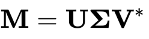
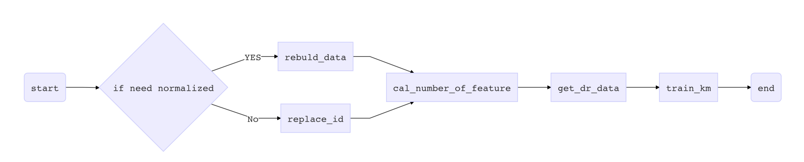

# A clustering method based on SVD and KMeans

1. In linear algebra, the singular value decomposition ([SVD](https://en.wikipedia.org/wiki/Singular_value_decomposition)) is a factorization of a real or complex matrix. It is the generalization of the eigendecomposition of a positive semidefinite normal matrix (for example, a symmetric matrix with non-negative eigenvalues) to any $m\times n$ matrix via an extension of the polar decomposition. It has many useful applications in signal processing and statistics.statistics.

2. Statement of the theorem about SVD

   Suppose **M** is an *m* × *n* matrix whose entries come from the field *K*, which is either the field of real numbers or the field of complex numbers. Then the singular value decomposition of **M** exists, and is a factorization of the form

   

 where

   - **U** is an *m* × *m* [unitary matrix](https://en.wikipedia.org/wiki/Unitary_matrix) over *K* (if *K* = , unitary matrices are [orthogonal matrices](https://en.wikipedia.org/wiki/Orthogonal_matrix)),
   - **Σ** is a [diagonal](https://en.wikipedia.org/wiki/Rectangular_diagonal_matrix) *m* × *n* matrix with non-negative real numbers on the diagonal,
   - **V** is an *n* × *n* [unitary matrix](https://en.wikipedia.org/wiki/Unitary_matrix) over *K*, and **V**∗ is the [conjugate transpose](https://en.wikipedia.org/wiki/Conjugate_transpose) of **V**.

3. [k-means clustering](https://en.wikipedia.org/wiki/K-means_clustering) is a method of vector quantization, originally from signal processing, that is popular for cluster analysis in data mining. k-means clustering aims to partition n observations into k clusters in which each observation belongs to the cluster with the nearest mean, serving as a prototype of the cluster. This results in a partitioning of the data space into Voronoi cells. k-Means minimizes within-cluster variances (squared Euclidean distances), but not regular Euclidean distances, which would be the more difficult Weber problem: the mean optimizes squared errors, whereas only the geometric median minimizes Euclidean distances. Better Euclidean solutions can for example be found using k-medians and k-medoids.

4. KMeansSVD Parameters

   | Parameters      | introduction                                    |
   | --------------- | ----------------------------------------------- |
   | base_data       | DataFrame.  Input data                          |
   | normalized_data | DataFrame. Normalized data                      |
   | dr_data         | DataFrame.  Dimensionality reduction data       |
   | Km_out_put_data | DataFrame. KMeans output data                   |
   | result_data     | DataFrame. Add grouping information to raw data |
   | u, s, v         | Matrix. SVD output                              |
   | cum_var_fig     | Cumulative variance diagram of SVD method       |
   | km_fig          | KMeans distortion distribution                  |
   | result_fig      | Classification result graph                     |
   | feature_num     | The feature number of SVD                       |
   | class_num       | the class number of Kmeans                      |

5. KMeansSVD Methods

   | Methods               | introduction                                |
   | --------------------- | ------------------------------------------- |
   | rebuild_data          | Construct normalized data                   |
   | replace_id            | Change the ID column to 'id' of the dataset |
   | cal_number_of_feature | Calculate the nominal quantity              |
   | get_dr_data           | Construct dimensionality reduction data     |
   | train_km              | Training KM model                           |
   | fit                   | Full process clustering entry               |

   Each method can be called separately, or the final result can be obtained by directly calling the fit() function. Alternatively, the fit() method can be modified as needed.

6. flow chart

   

   *  Data data must be in the following format

     |  ID  | Feature1 | Feature2 | Feature3 | Feature4 |
     | :--: | :------: | :------: | :------: | :------: |
     |  1   |    1     |    0     |    0     |    1     |
     |  2   |    0     |    3     |    1     |    1     |
     |  3   |    1     |    2     |    0     |    1     |

   * In cal_number_of_feature method, you can set the feature number and in train_km you can set the class number. Alternatively, you can also specify search criteria to calculate the number of features and the number of classes.
   * You can use **plt.show()** display the figure after **fit()**.

   

